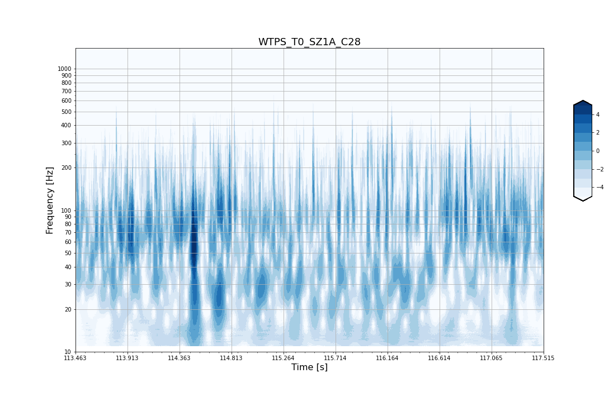
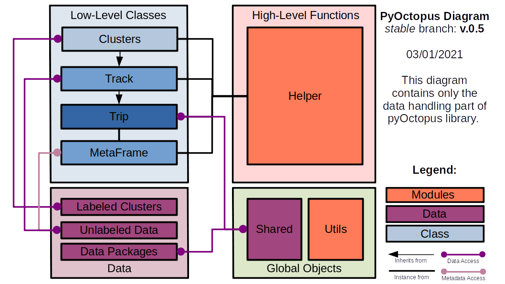
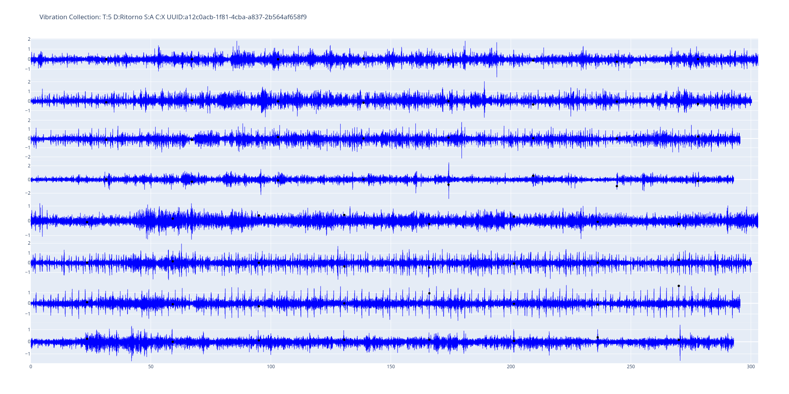
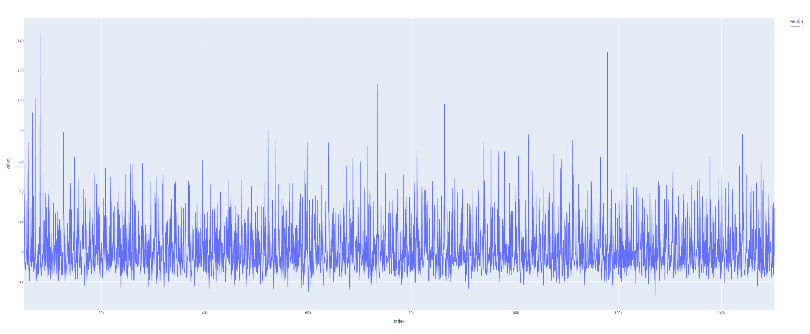
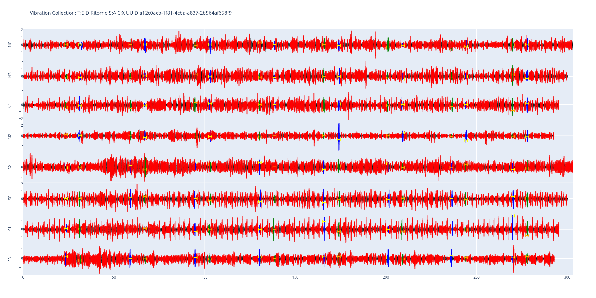

=========
pyOctopus 
=========

.. toctree::
   :glob:

Introduction
============

pyOctopus is a collection of modules written in Python to handle data and models related to Project OCTOPUS research activity #4.

.. warning:: The environment is quite unstable actually and what you will see now is only to set up the documentation: the images will be rebuilt after code optimization will be concluded.

About the OCTOPUS Project
-------------------------

The OCTOPUS project is a partnership between IVM and Università degli Studi di Napoli Federico
II in order to develop a product/service to detect eventual anomalies on a given rail track in the
wheel-rail interaction due to unusual behaviour of rotating machinery and/or defects in rails.

   
   Example of Wavelet Power Spectrum Distribution.

Features contained in pyOctopus (pseudo)package
-----------------------------------------------

Within my Master Thesis scope, in this library one can find several modules which should be
able to (I hope):

- (**done**) Extract metadata from file and collect in an ad-hoc meta-frame;
- (**done**) Object-oriented handling of metadata for data ingestion and manipulation;
- (**done**) Wavelet analysis of vibrational data in tracks;
- (**done - to fix**) Spatial syncing of signals;
- (**done - to fix**) Labeling Imputer on synced signals;
- (**not completed**) Dataset Clustering ;
- (**to be done**) Dataset semi-supervised classification ;
- (**to be done**) Anomaly detection with annotated dataset via supervised method;

pyOctopus overview
------------------

At this stage, pyOctopus is simply a data-handler with limited capabilities to filter and detect anomalies with Wavelet Analysis based approaches and some naive clustering approach.

   
   Class Diagram of pyOctopus.

pyOctopus relies on several classes in interaction. We got here four *data* classes: ``MetaFrame``, ``Trip``, ``Track``, ``Clusters`` (in order of abstraction) and three *auxiliary* modules collection (``Shared, Utils, Helper``). Let's describe them:

- *Data* classes:
   - **MetaFrame**: it provides a way to extract metadata about all trip available from the whole data packages set previously extracted and structured during the environment setup. It provides a way to select also only a subset of data with given property (e.g. only X-component dataset);
   - **Trip**: handles the metadata for a given trip, using both IVM data (from MetaFrame) or custom parameters (from ``shared``); 
   - **Track**; for a given Trip one can extract a subset of data (I called this extraction Track) and its istances will hold acceleration, speed and related quantity obtained via preprocessing. Actually when called it will actually shift the data in order to sort it properly (cfr. next sections)  
   - **Clusters**: For a given Track, Clusters handles all the data agglomerates (contiguous acceleration data which were labelled as "point of interest" by the anomaly detector algorithm and provides a way to perform clustering over them;
   - **Wave** (*experimental - not reported on the diagram*): it provides a way to perform algebraic manipulation of wavelet for a given track object. This was developed to perform a walevet cross-corrleation comparison but due to high impact on memory it isn't actually actively implemented.
- *Auxiliary* modules collection:
   - **Shared**: all parameters used globally in the project should be included in this file. After developign a proper data structure this part will be included into the final DB, so the explicit introduction of global variable will be deprecated;
   - **Utils**: modules which doesn't belong strictly to a given classe and could be used globally;
   - **Helper**: collection of scripts which are almost independent from each other and could be used in a standalone way. The helper function uses instances of data classes in order to make some preliminary evaluation about data.

Installation
------------

Actually pyOctopus lives only in a Git-Hub environment, i hope it could become like a Python package in order to automate deployment. 

Assuming to be in a Linux environment and within a Linux shell. 

.. note:: This installation walkthrough is rather "manual" and will be substituted with an automated, global configuration script (i.e. extending the ``ws_setup`` file).

1. Install git: ``sudo apt-get install git``;
2. Actually the git repository is private, so before downloading the dataset you should obtain access to the repository and add a SSH key to the ``.ssh/id_rsa`` related to your git-hub account. (`see here for more details <https://docs.github.com/en/free-pro-team@latest/github/authenticating-to-github/adding-a-new-ssh-key-to-your-github-account>`_);
3. Download the repository (e.g. ``git clone git@github.com:mario-ambrosino/pyOctopus.git) && cd pyOctopus``); 
4. After downloading, change permission to ``ws_setup`` with command ``chmod 644 ws_setup``;
5. Execute the ``ws_setup`` file: ``./ws_setup``
6. Execute ``echo'export PythonPATH=".env/bin/python3"' >> .env/bin/activate``
7. Check if there is a ``(.env)`` before command prompt: if not execute ``source .env\bin\activate``. If this doesn't work a problem occourred and you should manually troubleshot it.
8. Create and store the key in an ad-hoc folder: ``mkdir private && mkdir private/keys``;
9. Write the keyring JSON inside the ``private/keys`` folder. One way to obtain this is using the following command: ``echo `{"1": {"DATASET_ID": "1","DATASET_NAME": "Estratto_Rettilineo_AR","DATASET_REPOSITORY":`` ``"https://mega.nz/file/kscxRI6S", "KEY_REPOSITORY": "SECRET!SECRET!SECRET!"}}` >> private/keys/keys.json`` where ``SECRET!SECRET!SECRET!`` is a value transmitted by a proper communication channel. The shell-script part is finished, now we can pass to use Python, either if using the Python prompt;
10. Open a Python prompt writing ``python3`` in the shell;
11. Execute the command ``import octolib.helper as hp``;
12. Execute the helper module ``hp.init_workspace()``.

.. warning:: GitSecret will make 7, 8, 9 obsolete: the keys will be stored into the Git environment.

This actually should complete the setup. The first call of a Track or Trip class will generate automatically the MetaFrame object, indexing over all the available dataset.   

Examples
--------

We provide here some usage examples in form of minimal tutorial to use pyOctopus.

Free Exploration of Low-Level API
+++++++++++++++++++++++++++++++++

After having installed pyOctopus, you are at the stage that you don't know how to use exactly it. You need to make your hands dirty with some low-level command execution. Open the Python environment then and let's start.

MetaFrame loading
*****************

Let's import the metaframe library: 

.. code-block:: python3

   import octolib.shared as shared
   import octolib.metaframe as meta

Let's recall that the ``meta`` class requires a couple of mandatory parameters: ``path_data`` and ``path_meta``. For problem during documentation autodoc generation I had to clear the default parameters, so we need lo import also the shared module. Then we can load the metaframe.

.. code-block:: python3

   meta = meta.MetaFrame(path_data = shared.DATASET_PATH, path_meta = shared.META_PATH)

The ``meta`` object now has all the metaframe for a given dataset. Let's give a peek at its first row: thanks to its ``__getitem__`` method in :py:meth:`octolib.metaframe.MetaFrame.__getitem__` we can extract metadata both from index or from features. Let's start in a simpler way:

.. code-block:: python3

   meta[0] 

we got as output a given "row"

.. code-block:: python3

   >>> meta[0]                                                           
   ID                                a12c0acb-1f81-4cba-a837-2b564af658f9
   Dataset                                         Estratto_Rettilineo_AR
   Direction                                                      Ritorno
   Train                                                                5
   Avg_Speed                                                            A
   Component                                                            X
   Num_Trip                                                             2
   ...                                                                   
   Name: 0, dtype: object                                                

If we call the ``meta`` selecting a feature we obtain, choosing for example the feature ``ID``, all the UUIDs (a column of the metaframe).

.. code-block:: python3

   >>> meta["ID"]
   0     a12c0acb-1f81-4cba-a837-2b564af658f9
   1     0d1f9f2e-4e63-4246-9334-b52547a72738
   2     3c8f6a6a-6879-4271-8658-039124ac539b
   3     8b13c1b7-c36c-4ebe-8cc8-6733d69c76eb
   4     b9ca4a0e-194b-40cc-9d84-01e528c03e01
                        ...                 
   72    de43eaa0-ed9c-4f51-9bef-e00a14b05fde
   73    f84f2dcb-abd5-4442-be52-43cf4393b9b6
   74    a21d1f6a-1d55-40a8-840b-4e017a488269
   75    a0ad4360-0b71-4243-84c4-aad80062ffd9
   76    557d679d-4d21-4179-a01c-896cae64edb5
   Name: ID, Length: 77, dtype: object

The feature available in the metaframe actually are the following: 

.. code-block:: python3

   >>> list(meta.columns)
   ['ID', 'Dataset', 'Direction', 'Train', 'Avg_Speed', 'Component', 'Num_Trip', 'Engine_Status', 'Accel_Path', 'Vel_Path', 'Scores_Path', 'UnifiedScore_Path', 'is_ABU-B_enabled', 'is_ABU-A_enabled', 'N_acc', 'N_vel', 'N_discrepance', 'Reference_Bearing', 'Bearing_Columns', 'Weldings', 'Wheel_Fault', 'N_Shifts', 'S_Shifts']

Let's describe them one by one, either if there will be a dedicated session in which i will move this information.

- **ID** are the UUIDs used to access dataset with a unique identifier. The UUID is randomly generated either if I will choose a UUIDs creation schema related with a checksum-like method on a unique feature of the dataset (i.e. its relative path) in order to obtain a stable behaviour over different metaframe generation;
- **Dataset** holds the information about the data-package (e.g. "Estratto_Rettilineo_AR");
- **Direction** returns if the train is in "Andata" or "Ritorno" direction;
- **Train** returns the identifier of the train (i.e. "5" or "7");
- **Avg_Speed** returns the average speed for the train. It is hardcoded into the filename with letters "A", "B", "C", etc, each one being a multiple of 15 km/h
- **Component** returns the acceleration component of the dataset
- **Num_Trip** the train could perform different route in the same configuration, then this variable helps to separate them.
- **Engine_Status** sometimes there is only a engine running on a given axle box. "F" or "FF" will address condition different from the condition in which both the engine are on. This is explicited as a boolean variable in **is_ABU-A_enabled** and **is_ABU-B_enabled**.
- **[ITEM]_Path** suggests the path location of a file related to a given Trip.
- **N_acc** and **N_vel** indicates how much rows accelerometric and velocity signals have. We expect that these are the same but isn't always the case: in that case we got a **N_discrepance** variable different from zero and the related Trip is excluded (manually actually) from the ``meta.csv`` file. (I have to handle the error related to N_vel discrepance).
- **Reference_Bearing** holds the reference bearing for welding ground truth detection from IVM.
- **Bearing_Columns** holds the bearing sequence [5,6,7,8,9,10,11,12]: this is explicited into the dataset because we can have different sensor positions. However, it isn't really used actually.
- **Weldings** holds the sequence of samples in which IVM spotted a welding on ground after track inspection.
- **Wheel_Fault** boolean value which indicates if the train has some defects in wheel.
- **N_shifts** and **S_shifts** are the samples shift with respect to the reference bearing. It was used to sync signals but i stored the mean value into shared location and removed this information. I leave it in case it is necessary to extend to different shifts for different trains.

We can also select a specific value with the ``__call__`` method: :py:meth:`octolib.metaframe.MetaFrame.__call__`:

.. code-block:: python3

   >>> meta(uid=0,value="ID")
   'a12c0acb-1f81-4cba-a837-2b564af658f9'

Trip Class
**********

Either if Trip is the *grand-father* of all classes (being Track its son and Clusters its grand-son), it isn't really useful to use at this stage, being it a simple representation of a metaframe's row.

We recall only the usage of its :py:meth:`octolib.trip.Trip.__init__` method:

.. code-block:: python3

   >>> import octolib.trip as trip
   >>> X = trip.Trip("a12c0acb-1f81-4cba-a837-2b564af658f9")
  [Sun Jan  3 18:14:55 2021] # # Loading PyOctopus Trip Module
 
   # Let's explore what are its attributes clicking on <TAB>:

   >>> X.
   X.accel_path         X.extract_list(      X.sensors
   X.avg_speed          X.is_wheel_faulty    X.sides
   X.bearing_columns    X.meta(              X.train
   X.component          X.num_samples        X.uuid
   X.dataset            X.num_trip           X.vel_path
   X.direction          X.pos_zero           X.weldings
   X.engine_conf        X.reference_bearing  
   X.extract_item(      X.scores_path  

   >>> X.weldings
   array([ 16127,  33261,  50484,  67568,  84577, 101505, 118243, 134458])

Track class will be more complex, I promise!

Track Class
***********

Track Class is a central component of pyOctopus. It inherits the attributes seen in Trip objects, but it handles also preprocessed attributes as we can see in its rich attributes collection.

.. code-block:: python3

   >>> import octolib.track as track
   >>> X = track.Track("a12c0acb-1f81-4cba-a837-2b564af658f9")
   [Sun Jan  3 18:28:00 2021] # # Loading PyOctopus Trip Module
   [Sun Jan  3 18:28:00 2021] # Init Completed.
   [Sun Jan  3 18:28:02 2021][T:5][D:Ritorno][S:A][N:2][X:X] # TRIP LOADED
   [Sun Jan  3 18:28:03 2021] # Acceleration Preprocessing Completed.

   # Let's explore what are its attributes clicking on <TAB>:
   >>> X.
   X.accel                      X.plot_clusters(
   X.accel_path                 X.plot_scores(
   X.anomalies                  X.pos_zero
   X.anomaly_cluster            X.position
   X.avg_speed                  X.positions
   X.bearing_columns            X.preprocess_accelerations(
   X.bearings_labels            X.reference_bearing
   X.component                  X.reference_sensor
   X.dataset                    X.scores
   X.direction                  X.scores_path
   X.engine_conf                X.sensors
   X.evaluate_prediction(       X.shifted_weldings
   X.extract_item(              X.shifts
   X.extract_list(              X.sides
   X.get_acceleration(          X.start
   X.get_anomalies(             X.stop
   X.get_anomaly_clusters(      X.thresholds
   X.get_avg_previous_pos(      X.time
   X.get_dict_direction(        X.total_pad
   X.get_speed(                 X.train
   X.get_wsd(                   X.uuid
   X.get_z_score(               X.vel
   X.is_wheel_faulty            X.vel_path
   X.meta(                      X.weldings
   X.num_samples                X.weldings_echoes
   X.num_trip                   X.weldings_holder
   X.permutation_sensors        X.wsd
   X.plot_accelerations(        

Here we can a lot of different function. Let's explain how :py:meth:`octolib.track.Track.__init__` method works in order to grasp the meaning of someone of them:

1. First it loads ``start`` and ``stop`` delimiters (usually are the naive 0 and "last" sample, these are the defaults parameters when the ``__init__`` method isn't filled with these parameters;
2. It loads all the raw kinematics property from files related to the trip (through some method like ``self.get_speed()``);
3. With respect to train and direction attributes, it generates a sensor index permutation, generating some related dictionary to handle this;
4. From ``shared`` loads the shift corresponding to the track and define a dictionary to hold this information.
5. Calculate the necessary padding to perform a circular roll on all the tracks without going out of the array (SOME BUG HERE!);
6. Translate the weldings (and relative echoes) according to the shift for each sensor signal.
7. Store acceleration in a proper structure (a dictionary) called ``self.accel``;

This is done with the help of :py:meth:`octolib.track.Track.preprocess_accelerations` and related ``get`` methods.

Are you bored enough? Let's plot some images then!

.. code-block:: python3

   >>> X.plot_accelerations() 

   
   Output of the ``plot_accelerations()`` method. Notice that here the syncing isn't obtained in a good way. Actually problems are occurring and the syncing is to be further investigated.

Here we are seeing the accelerations sorted and separated among North and South branches. Let's detect the anomalies then and after plot them:

.. code-block:: python3

   # Performing an anomaly detection on the default side and sensor ("S0")  
   >>> X.get_anomalies()
   [Sun Jan  3 19:23:20 2021] # Starting WSD generation module.
   [Sun Jan  3 19:23:22 2021] # WSD generation module completed
   [Sun Jan  3 19:23:22 2021] # POI Discovery module started.
   [Sun Jan  3 19:23:22 2021] # Z-score generation module started.
   [Sun Jan  3 19:23:22 2021] # Z-score generation module completed.
   [Sun Jan  3 19:23:22 2021] # POI Discovery module completed. POI found = 55106

So we obtained 55106 point of interest for the sensor S0. Let's plot the obtained z-score with the awesome ``plotly`` library:

.. code-block:: python3

   >>> import plotly.express as px
   >>> scores = X.scores["S"][0]
   >>> fig = px.line(scores)
   >>> fig.show()

   
   *z-score* obtained for the S0 sensor.

The related helper function uses this kind of data to retrieve the mean position of anomalous agglomerates and construct Cluster objects, so we will dive in into it. Let's use :py:meth:`octolib.helper.test_alignment_score` and see the output of the first computation (it is a loop over the whole metaframe)

.. code-block:: python3

   >>> import octolib.helper as hp
   >>> hp.test_alignment_score()
   [Sun Jan  3 20:05:24 2021] # Init Completed.
   [Sun Jan  3 20:05:24 2021] # Init Completed.
   [Sun Jan  3 20:05:26 2021][T:5][D:Ritorno][S:A][N:2][X:X] # TRIP LOADED
   [Sun Jan  3 20:05:27 2021] # Acceleration Preprocessing Completed.
   [Sun Jan  3 20:05:27 2021] # Sensor:1/4 - Side:N
   [Sun Jan  3 20:05:27 2021] # Starting WSD generation module.
   [Sun Jan  3 20:05:28 2021] # WSD generation module completed
   [Sun Jan  3 20:05:28 2021] # POI Discovery module started.
   [Sun Jan  3 20:05:28 2021] # Z-score generation module started.
   [Sun Jan  3 20:05:29 2021] # Z-score generation module completed.
   [Sun Jan  3 20:05:29 2021] # POI Discovery module completed. POI found = 53120
   (...)
   [Sun Jan  3 20:05:40 2021] # Anomaly Detection completed.
   [Sun Jan  3 20:05:40 2021] # Starting DBSCAN clustering.
   [Sun Jan  3 20:05:40 2021] # DBSCAN -> N0 sensor
   [Sun Jan  3 20:05:44 2021] # DBSCAN -> Clusters: 517; Outliers: 757;
   (...)
   [Sun Jan  3 20:06:07 2021] # DBSCAN -> S3 sensor
   [Sun Jan  3 20:06:11 2021] # DBSCAN -> Clusters: 576; Outliers: 780;
   [Sun Jan  3 20:06:11 2021] # DBSCAN clustering Completed.
   [Sun Jan  3 20:06:11 2021] # Starting performance evaluation.
   [Sun Jan  3 20:06:11 2021] # Performance. PD: 100.00%; ED: 100.00%; PFA: 96.91%
   (...)
   [Sun Jan  3 20:06:11 2021] # Performance. PD: 100.00%; ED: 100.00%; PFA: 97.22%

   
   Clustered Vibration obtained with our methods. Please Note: the parameters weren't setted up properly, this is only a demonostation of the result obtained by the helper function. 

Classes extended description
============================

High-Level Classes
------------------

Helper Module Collection
++++++++++++++++++++++++

The helper modules are (mostly) all independent scripts which inherits methods from low level classes (MetaFrame, Trip, Track, Clusters classes). 

.. automodule:: octolib.helper
   :members:
   :undoc-members:
   :show-inheritance:

Low-Level Classes
-----------------

MetaFrame Class
+++++++++++++++

.. automodule:: octolib.metaframe
   :members:
   :undoc-members:
   :show-inheritance:

Trip Class
++++++++++

.. automodule:: octolib.trip
   :members:
   :undoc-members:
   :show-inheritance:

Track Class
+++++++++++

.. automodule:: octolib.track
   :members:
   :undoc-members:
   :show-inheritance:

Clusters Class
++++++++++++++

.. automodule:: octolib.clusters
   :members:
   :undoc-members:
   :show-inheritance:

Utils Modules Collection
++++++++++++++++++++++++

.. automodule:: octolib.utils
   :members:
   :undoc-members:
   :show-inheritance:

Shared Modules Collection
+++++++++++++++++++++++++

.. automodule:: octolib.shared
   :members:
   :undoc-members:
   :show-inheritance:
